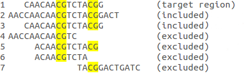

BSPAT
=====
v1.0.1-beta

# 1.Introduction
BSPAT is a fast tool for analysing co-occurrence methylation patterns in bisulfite sequencing data.
BSPAT has the following features: 1) instead of using multiple/pairwise sequence alignment methods, BSPAT adopts Bismark mapping results to provide fast alignment of sequence reads; 2) BSPAT summarizes and visualizes DNA methylation co-occurrence patterns at a single nucleotide level, which provide valuable information in understanding the mechanism and regulation of DNA methylation; 3) based on methylation co-occurrence patterns, BSPAT can automatically detect potential allele-specific methylation (ASM) patterns

This manual is for command line version of BSPAT.

Web version of BSPAT can be found at [website](http://cbc.case.edu/BSPAT/) or [github](https://github.com/lancelothk/BSPAT).

Reference: [Hu, K., Ting, A. H., & Li, J. (2015). BSPAT: a fast online tool for DNA methylation co-occurrence pattern analysis based on high-throughput bisulfite sequencing data. BMC Bioinformatics, 16(1), 220.](http://bmcbioinformatics.biomedcentral.com/articles/10.1186/s12859-015-0649-2#CR10)

# 2.Prerequisite
* Java 1.8 or higher
* Bismark and its required softwares (e.g. python, samtools, bowtie2)

##2.1 install
Unzip BSPAT_standALone zip file. Executable files are under bin folder.

To add BSPAT to $PATH, [check here](http://askubuntu.com/questions/109381/how-to-add-path-of-a-program-to-path-environment-variable)

# 3.Demo
Following demo is tested with bowtie2-2.3.4.2-linux-x86_64, Bismark_v0.19.1, samtools1.6
[Download demo data](demo.zip)

Demo folder structure:
```
.
├── demoSequence.fastq
├── ref
│   └── demoReference.fasta
└── target.bed
```
All following command are executed in demo folder. Assuming BSPAT, Bismark, and Bismark required softwares are setup properly(added to $PATH). You can also execute commands through relative path, e.g. ../bin/BSPAT, which assume bin folder is in the same level of demo folder.

## 3.1 run bismark
```
>bismark_genome_preparation ref
>bismark ref demoSequence.fastq
```
After execution, demo folder looks like:
```
.
├── demoSequence.fastq
├── demoSequence.fastq_bismark.bam
├── demoSequence.fastq_bismark_SE_report.txt
├── ref
│   ├── Bisulfite_Genome
│   │   ├── CT_conversion
│   │   │   ├── BS_CT.1.ebwt
│   │   │   ├── BS_CT.2.ebwt
│   │   │   ├── BS_CT.3.ebwt
│   │   │   ├── BS_CT.4.ebwt
│   │   │   ├── BS_CT.rev.1.ebwt
│   │   │   ├── BS_CT.rev.2.ebwt
│   │   │   └── genome_mfa.CT_conversion.fa
│   │   └── GA_conversion
│   │       ├── BS_GA.1.ebwt
│   │       ├── BS_GA.2.ebwt
│   │       ├── BS_GA.3.ebwt
│   │       ├── BS_GA.4.ebwt
│   │       ├── BS_GA.rev.1.ebwt
│   │       ├── BS_GA.rev.2.ebwt
│   │       └── genome_mfa.GA_conversion.fa
│   └── demoReference.fasta
└── target.bed
```

## 3.2 BSPAT
```
>BSPAT ref demoSequence_bismark_bt2.bam target.bed
```
Result files are:
```
.
├── demo-31-99-test-plus_bismark.analysis_ASM.txt
├── demo-31-99-test-plus_bismark.analysis_Methylation.txt
├── demo-31-99-test-plus_bismark.analysis_MethylationWithSNP.txt
├── demo-31-99-test-plus_bismark.analysis_report.txt
├── demo-31-99-test-plus_bismark.analysis.txt

```
## 3.3 BSPAT_figure
```
>BSPAT_figure demo-31-99-test-plus_bismark.analysis_Methylation.txt demo-31-99-test-plus_bismark.analysis_report.txt
>BSPAT_figure demo-31-99-test-plus_bismark.analysis_ASM.txt -a
```
Result files are:
```
.
├── demo-31-99-test_bismark-plus.analysis_ASM.png
├── demo-31-99-test_bismark-plus.analysis_Methylation.png
```

# 4.Interface
## 4.1 BSPAT:
```
usage: BSPAT [options] <reference file Path or file> <bismark result path or file> <target region file>
 -b <arg>   Bisulfite Conversion Rate
 -c <arg>   Critical Value
 -h         Help
 -i <arg>   Sequence Identity Threshold
 -m <arg>   Methylation pattern Threshold
 -n <arg>   MethylationWithSNP pattern Threshold
 -o <arg>   Output Path
 -s <arg>   significant SNP Threshold
 -t <arg>   Number of threads
```
## 4.2 BSPAT_figure:
```
usage: BSPAT_figure [options] <pattern file> {<report file> | -a }
 -a         Draw ASM pattern. In this case, only pattern result is
            required.
 -f <arg>   Text font used in figure. Default is Arial
 -h         Help
 -t <arg>   Figure format. Support eps and png. Default is png
```

Examples:
```
>BSPAT ref demoSequence.fastq_bismark.bam target.bed
>BSPAT_figure demo-31-99-test_bismark.analysis_Methylation.txt demo-31-99-test_bismark.analysis_report.txt
>BSPAT_figure demo-31-99-test_bismark.analysis_ASM.txt -a
```

# 5.Input and output
## 5.1 Input
### 5.1.1 Reference sequence
**Caution:** Since Bismark attempts to extract 2 additional bps from end of reference sequence to be able to determine the sequence context (CG, CHG or CHH). Reads align to exact end of reference sequence will be rejected in Bismark result. To avoid exclusion of those reads, it is recommended to add 2 additional bps in both ends of reference sequence.
### 5.1.2 Bismark results
BSPAT supports both sam and bam format Bismark results.
### 5.1.3 Target regions bed file
Tab delimited five columns bed file:
```
<ref name:string>   <start:int>   <end:int> <region name:string>   <ref_strand:+or->
```
`<ref name>` should come from the reference names in reference sequence file. One target region file can have multiple regions come from same reference sequence. Also one target region file can have multiple regions share same region name but have different locations.

`<ref_strand>` is used to specify if the reference sequence come from plus or minus strand of reference genome. If `<ref_strand>` is minus, BSPAT will automatically reverse the result pattern to match plus strand reference.

**Notice**: Only sequences fully covering target region will be included in following analysis. E.g.:



Sequence visualization tools will be helpful to pick correct target regions from sequencing data. For example, use samtools:
 ```
 >samtools sort demoSequence.fastq_bismark.bam > demoSequence.fastq_bismark.sorted.bam
 >samtools index demoSequence.fastq_bismark.sorted.bam
 >samtools tview demoSequence.fastq_bismark.sorted.bam ref/demoSequence.fastq
 1         11        21        31        41        51        61        71        81        91        101       111
 CCAATAAACATCTCTAATGAGGGAGGAGGCCCGAGGATGGCTGGGTTTGATTTATGACTGGAGGAGAAGGTCCACTTCCCACTGCGAAGCAGGCGACCTGCTCGCCGCCCANN
      ...T..T.T...............TTT........T................T.............TT.T..TTT.T..Y....T...YR.TT..T.T.
      AAATATTTTTAATGAGGGAGGAGGTTTGAGGATGGTTGGGTTTGATTTATGATTGGAGGAGAAGGTTTATTTTTTATTGCGAAGTAGGTCATTTGTT
      AAATATTTTTAATGAGGGAGGAGGTTTGAGGATGGTTGGGTTTGATTTATGATTGGAGGAGAAGGTTTATTTTTTATTGCGAAGTAGGCAATTTGTT
      AAATATTTTTAATGAGGGAGGAGGTTCGAGGATGGTTGGGTTTGACTTATGATTGGAGGAGAAGGTTTATTTTTTATTGTGAAGTAGGTAATTTGTTT
      AAATATTTTTAATGAGGGAGGAGGTTTGAGGATGGTTGGGTTTGATTTATGATTGGAGGAGAAGGTTTATTTTTTATTGCGAAGCAGGCGATTTGTT
      AAATATTTTTAATGAGGGAGGAGGTTTGAGGATGGTTGGGTTTGATTTATGATTGGAGGAGAAGGNTTATTTCTTATTGCGAAGTAGGGGATTTG
      AAATATTTTTAATGAGGGAGGAGGTTTGAGGATGGTTGGGTTTGATTTATGATTGGAGGAGAAGGTTTANTTTTTATTGTGAAGTAGGTAATTTGT
      AAATATTTTTAATGAGGGAGGAGGTTTGAGGATGGTTGGGTTTGATTTATGATTGGAGGAGAAGGTTTATTTTTTATTGTGAAGTAGGTAATTTGTT
      ....
 ```

## 5.2 Output
### 5.2.1 Sequences output
File named "`<ref name>-<start>-<end>-<region name>-<strand>_bismark.analysis.txt`". Each line is a sequence fully cover target region, organized as:
```
<start>   <end>   <methylationString> <ID>   <originalSequence> <BisulfiteConversionRate>   <methylationRate>   <sequenceIdentity>
```

In methylation string, "@@" represents methylated CpG site. "**" represents un-methylated CpG site.

### 5.2.2 Co-occurrence Methylation Pattern
File named "`<ref name>-<start>-<end>-<region name>-<strand>_bismark.analysis_Methylation.txt`". Each line is a co-occurrence pattern in target region, organized as:
```
<Methylation Pattern>   <count>   <percentage> <PatternID>
```
"@@" represents methylated CpG site. "**" represents un-methylated CpG site.


### 5.2.3 Co-occurrence Methylation Pattern with SNP
File named "`<ref name>-<start>-<end>-<region name>-<strand>_bismark.analysis_MethylationWithSNP.txt`". Each line is a co-occurrence pattern with SNP in target region, organized as:
```
<MethylationWithSNP Pattern>   <count>   <percentage> <MethylParent>
```
"@@" represents methylated CpG site. "**" represents un-methylated CpG site.

### 5.2.4 ASM pattern
File named "`<ref name>-<start>-<end>-<region name>-<strand>_bismark.analysis_ASM.txt`". It includes pattern with reference allele and pattern with alternative allele, organized as:
```
<ASM Pattern>   <count>   <percentage>
```
Followed by methlation level of each CpG site.

"@@" represents methylated CpG site. "**" represents un-methylated CpG site.

### 5.2.5 Report
File named "`<ref name>-<start>-<end>-<region name>-<strand>_bismark.analysis_report.txt`". It includes:
- summary of target region. line 1-2
- parameters used in analysis. line 3-8
- sequences report. line 9-10
- methylation level of CpG sites in target region. line 11-15
- Mismatch report. Format: `<index>    <ref allele>   <A> <C> <G> <T> <N> <total> <coverage>`. line 16 to end of file.
